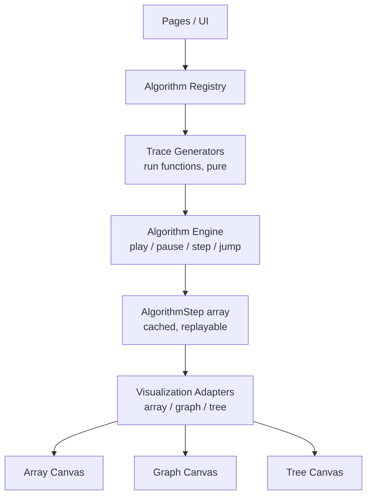

# Visual Algorithm Explorer

An interactive, in-browser playground for understanding data structures and algorithms through step-by-step visualizations — sorting, searching, graph traversal, and tree operations, each with full playback controls, synchronized pseudocode highlighting, and per-step explanations.

Built as a final-year project and portfolio piece: a fully working, tested, and typed React/TypeScript application, not a UI mockup.

**Live demo:** https://dsa-visualizer-six-rose.vercel.app/

## Main features

- **Step-by-step playback** — Play, Pause, Next Step, Previous Step, Reset, speed control, and an **Execution Timeline** slider to jump straight to any step in the run
- **Synchronized pseudocode & explanations** — the current line of pseudocode is highlighted, and a plain-English description of what's happening (with live variable values) updates every step
- **Three visualization domains**, one shared engine: array-based (sorting/searching), graph-based (traversal/shortest path), and tree-based (BST operations)
- **Custom input** — type your own array, or generate random/nearly-sorted/reverse-sorted/duplicate-heavy variants
- **Test Case Panel** — sample and edge cases (basic, sorted, reverse, duplicates, negative values) per sorting algorithm, each with Run (instant pass/fail against the expected output) and Visualize (step through it)
- **Interview Problem Mode** — four classic interview questions (Two Sum, Maximum Subarray, Valid Parentheses, Best Time to Buy and Sell Stock), each with a problem statement, worked example, and the same playback experience as the algorithm library
- **Algorithm Comparison Mode** — run two or three sorting algorithms on the identical input, side by side, with shared Play/Pause/Reset/Speed controls and live comparison/swap/step counts
- **Favorites, keyboard shortcuts, dark mode, and full mobile responsiveness**
- **Error boundaries** at the route and visualization level, so a crash in one view never takes down the whole app

## Screenshots

_Add screenshots or a short GIF here before sharing this repo — e.g. the algorithm detail view, Comparison Mode side-by-side, and the Interview Problems list. `docs/screenshots/` is a reasonable place to keep them._

## Supported algorithms

| Category | Algorithms |
| --- | --- |
| Sorting | Bubble Sort, Selection Sort, Insertion Sort, Merge Sort, Quick Sort, Heap Sort |
| Searching | Linear Search, Binary Search |
| Graphs | Breadth-First Search, Depth-First Search, Dijkstra's Algorithm |
| Trees | BST Insert, BST Delete, In-Order Traversal |

## Interview problems

| Problem | Difficulty | Topics |
| --- | --- | --- |
| Two Sum | Beginner | Array, Hash Map |
| Maximum Subarray (Kadane's Algorithm) | Intermediate | Array, Dynamic Programming |
| Valid Parentheses | Beginner | Stack, String |
| Best Time to Buy and Sell Stock | Beginner | Array, Greedy, Dynamic Programming |

Two more (Move Zeroes, Longest Common Prefix) are scoped but not yet implemented — see **Future Improvements**.

## Tech stack

- React 19 + TypeScript (strict mode)
- Vite 7
- Tailwind CSS v4
- React Router v7 (lazy-loaded routes)
- Framer Motion
- Zustand (persisted theme + favorites stores)
- Radix UI primitives + a hand-built shadcn/ui-style component layer
- Lucide React icons
- Vitest + Testing Library

## Architecture

The core design principle: **algorithms are pure data generators, decoupled from rendering.** An algorithm's `run()` function is a generator that yields plain-data `AlgorithmStep` objects — it has no knowledge of React, canvases, or colors. A visualization-specific *adapter* turns the accumulated steps into a renderable scene, and a *canvas* component draws that scene. This is what let the project grow from 1 visualization type to 3 (array → graph → tree) and from 6 algorithms to 17 without ever touching the playback engine.



- **Algorithm Registry** (`src/algorithms/`) — one file per algorithm, each exporting an `AlgorithmDefinition`: id, name, complexity, pseudocode, and a `run()` generator. Interview problems (`src/algorithms/interview/`) are a thin extension of the same shape, adding a problem statement, topics, and a worked example.
- **Algorithm Engine** (`src/engine/AlgorithmEngine.ts`) — drains a `run()` generator into a cached, replayable step array, then owns playback state (current index, playing/paused, speed). `jumpToStep` powers both "jump to end" and the Execution Timeline slider.
- **Adapters** (`src/engine/adapters/`) — turn accumulated steps into a scene description (which elements are highlighted, sorted, compared, etc.), one per visualization type.
- **Canvases** (`src/components/visualization/`) — pure rendering of a scene description, with Framer Motion handling element-position animation.
- **Pages** (`src/pages/`) — compose engine + adapter + canvas + controls per route. `AlgorithmDetailPage` handles the algorithm library; `ComparePage` runs several engine instances side by side; `InterviewProblemDetailPage` handles the four interview problems, whose input shapes vary (plain array vs. array+target vs. a string) more than the library's algorithms do.

## Testing

Vitest + Testing Library, run with `npm run test`. Current suite: **181 tests across 10 files**, covering:

- `AlgorithmEngine` — full playback lifecycle, including `jumpToStep` boundary/clamping behavior (used by the Execution Timeline)
- All 6 sorting algorithms and both searching algorithms, across 7 input shapes each
- BST insert/delete structural invariants
- The array adapter's accumulation logic (sorted-mark clearing, eliminated ranges, done-outcome discrimination)
- Custom array input parsing
- The four interview problems (Two Sum, Kadane's, Valid Parentheses, Best Time to Buy and Sell Stock), including the canonical LeetCode examples for each
- The Test Case Panel's evaluation logic
- Comparison Mode's shared-input guarantee (every lane runs the exact same array)
- The Execution Timeline slider's step-jump math

## Local setup

```bash
git clone https://github.com/tanmay2612/DSA-Visualizer.git
cd DSA-Visualizer
npm install
npm run dev       # http://localhost:5173
```

## Build instructions

```bash
npm run build      # tsc -b && vite build — output in dist/
npm run preview    # serve the production build locally
npm run test        # run the test suite
npm run lint        # eslint
npm run typecheck   # tsc -b --noEmit
```

The production build is verified against Vercel's default static-site settings (build command `npm run build`, output directory `dist`).

## Future improvements

- Two more interview problems: Move Zeroes, Longest Common Prefix
- Merge Sort / Quick Sort lanes in Comparison Mode (their recursive traces need a different timeline model than the three linear-pass sorts currently supported)
- Screenshots/GIFs in this README
- A proper "stack" visual for Valid Parentheses (currently visualized as a fixed-position character array with accumulating highlights, rather than an actually growing/shrinking stack)

Deliberately **not** planned, to keep this a focused student project rather than a product: authentication, a backend/database, AI features, an online judge, arbitrary code execution, multiplayer/social features, or a payment system.
